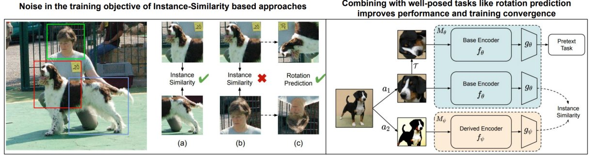

# Self-Supervised Learning

This repository implements self-supervised visual representation learning with SwAV and an auxiliary rotation-prediction task. It includes two pretraining paths, a shared linear-evaluation script, and example multi-GPU training recipes.

## Training Approach

Both pretraining paths create multiple augmented crops from each image and use a ResNet backbone with a projection head and prototype layer. SwAV computes balanced prototype assignments with the distributed Sinkhorn-Knopp procedure, then trains the network to predict assignments across different views. The rotation-aware path shares the backbone and adds a classifier for the rotations of two augmented views; its weighted cross-entropy is added to the SwAV loss. Training uses SGD with LARS, learning-rate warmup followed by cosine decay, and mixed precision by default.

## Research Question

**Does predicting image rotation alongside SwAV improve the quality of learned visual features?**

The repository makes this question testable by comparing a SwAV baseline with a SwAV+RotNet model under the same training recipe. The rotation-aware model predicts one of four rotations (0, 90, 180, or 270 degrees) for two augmented views. Its rotation cross-entropy is weighted and added to the SwAV clustering loss (`--rot_wt`, default `0.1`).

**Answer from the available project artifacts:** the code defines the comparison, but does not establish that rotation prediction improves accuracy. The checked-in files do not include run logs or a numeric results table from which to verify a winner. Train both variants and compare their linear-evaluation top-1 accuracy under the same data and settings to answer this empirically.

## What Is Included

- `main_swav.py` trains the SwAV baseline.
- `main_swav_rotnet.py` trains SwAV with the auxiliary rotation objective.
- `eval_linear.py` trains a linear classifier on frozen ResNet features and reports validation top-1 and top-5 accuracy.
- `src/multicropdataset.py` builds the multi-crop views and rotation labels.
- `src/resnet50.py` and `src/resnet50_rotnet.py` define the backbone and projection/task heads.
- `scripts/` contains example 50-epoch training recipes.
- `fig.jpg` is the existing project figure and is retained below. The repository does not include its source data; use the evaluation logs for reproducible numeric comparisons.

## Clone

```bash
git clone https://github.com/hassaan4717/Self-Supervised-Learning.git
cd Self-Supervised-Learning
```

## Requirements

Training uses PyTorch distributed training with the NCCL backend, so the commands below target Linux with CUDA-capable NVIDIA GPUs. Install a CUDA-enabled build of PyTorch and a compatible torchvision version using the [official PyTorch installation selector](https://pytorch.org/get-started/locally/). The project also imports NumPy, pandas, and Pillow:

```bash
python -m pip install numpy pandas pillow
```

The repository does not pin dependency versions in a requirements file. Select PyTorch and torchvision versions compatible with the installed CUDA driver.

## Prepare ImageNet

ImageNet is not included. Arrange the dataset as class-organized folders readable by `torchvision.datasets.ImageFolder`:

```text
/path/to/imagenet/
	train/
		n01440764/
			image.JPEG
		...
	val/
		n01440764/
			image.JPEG
		...
```

Pretraining's `--data_path` must point directly to `train/`. Linear evaluation's `--data_path` must point to the parent directory containing both `train/` and `val/`.

## Pretrain

The example recipe uses four GPUs, 50 epochs, two 224-pixel crops and six 96-pixel crops. `--batch_size` is per GPU, making the total batch size 1,024 with four processes. Adjust the GPU count and per-GPU batch size for your hardware.

Set paths and shared recipe arguments in Bash:

```bash
IMAGENET_ROOT=/path/to/imagenet
PRETRAIN_ARGS=(
	--arch resnet50
	--data_path "$IMAGENET_ROOT/train"
	--nmb_crops 2 6
	--size_crops 224 96
	--min_scale_crops 0.14 0.05
	--max_scale_crops 1.0 0.14
	--crops_for_assign 0 1
	--temperature 0.1
	--epsilon 0.05
	--sinkhorn_iterations 3
	--feat_dim 128
	--nmb_prototypes 3000
	--queue_length 0
	--epochs 50
	--batch_size 256
	--base_lr 1.2
	--final_lr 0.0012
	--freeze_prototypes_niters 313
	--wd 0.000001
	--warmup_epochs 10
	--start_warmup 0.3
	--use_fp16 true
	--checkpoint_freq 1
)
```

Train the baseline and rotation-aware variant into separate output directories:

```bash
torchrun --standalone --nnodes=1 --nproc_per_node=4 main_swav.py \
	"${PRETRAIN_ARGS[@]}" --dump_path runs/swav

torchrun --standalone --nnodes=1 --nproc_per_node=4 main_swav_rotnet.py \
	"${PRETRAIN_ARGS[@]}" --rot_wt 0.1 --dump_path runs/swav_rotnet
```

Each run writes `checkpoint.pth.tar`, periodic checkpoints under `checkpoints/`, training logs, and serialized statistics to its `--dump_path`. Keep the baseline and rotation-aware output directories separate so checkpoints are not overwritten.

## Linear Evaluation

Run the linear probe for either pretrained checkpoint. The backbone features are computed without gradients while the linear classifier is trained. Use a different output directory for each evaluation run:

```bash
IMAGENET_ROOT=/path/to/imagenet

torchrun --standalone --nnodes=1 --nproc_per_node=4 eval_linear.py \
	--data_path "$IMAGENET_ROOT" \
	--pretrained runs/swav/checkpoint.pth.tar \
	--epochs 25 \
	--batch_size 64 \
	--lr 0.3 \
	--dump_path runs/swav_linear
```

To evaluate the rotation-aware model, use `runs/swav_rotnet/checkpoint.pth.tar` as `--pretrained` and a separate `--dump_path`, such as `runs/swav_rotnet_linear`. Compare the best validation top-1 accuracies in the two evaluation logs; the script also reports top-5 accuracy.

## Existing Figure

The figure already present in the repository is preserved here:



## License

This project is distributed under the MIT License. See [LICENSE](LICENSE).
